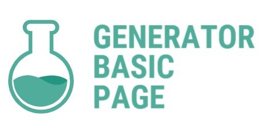

This project is a predefined base structure with all files and configured tasks for creating a web site/page.

# Version 2.1.1

## Technologies

- **[Pug](https://pugjs.org/api/getting-started.html)** (formerly _Jade_) is using for creating HTML
- **[Sass](https://sass-scss.ru/)** (_Scss_) is using fro creating CSS
- **[TypeScript](http://www.typescriptlang.org/index.html)** is using for transpaling to plain JavaScript.
- For supporting some rare or out of date features you can configure **Modernizr** (all checks, modules are configures in `modernizr-config.json`)

  > All settings could be found there: https://modernizr.com/download?setclasses

- **[normalize.css](https://necolas.github.io/normalize.css/)** (its SCSS version) is using for resetting / normalizing browsers stylings to look everything the same

~~- **[Gulp](https://gulpjs.com/)** is using to manage build / create/ serve tasks~~

> ~~Paths for Gulp tasks are configured at `project.config.json`. All Gulp tasks are moved to `./gulp.`. The main `gulpfile.babel.js` is holding only main tasks to working on project~~

## TODO

> 3.0.0

- Migrate to ~~WebPack~~ **Vite**
- Add feature to add new pug pages and scss files via Terminal
- Convert project to GBP-CLI
