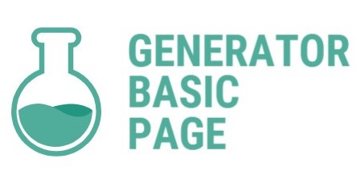

Проект представляет собой предопределённую базовую структуру со всеми необходимыми файлами и настроенными процессами для создания web-проекта.

# Версия 2.1.1

- В новой редакции JavaScript заменён на TypeScript.

## Технологии

- Для HTML используется препроцессор **[Pug](https://pugjs.org/api/getting-started.html)** (*Jade*)
- Для CSS используется препроцессор **[Sass](https://sass-scss.ru/)** (*Scss*)
- Подключена библиотека **Modernizr** (необходимые проверки, модули настраиваются в файле `modernizr-config.json`)
> Для выбора настроек: https://modernizr.com/download?setclasses

- Подключен **[normalize.css](https://necolas.github.io/normalize.css/)** (его SCSS версия)

> Настройка путей для gulp тасков в файле `project.config.json`
> Gulp таски вынесены в отдельный каталог `./gulp/`. В основном `gulpfile.babel.js` настраиваются только основные таски для работы с проектом

## TODO

> 3.0.0

- Перейти на WebPack
- Добавить возможность создания страниц и scss файлов через консоль